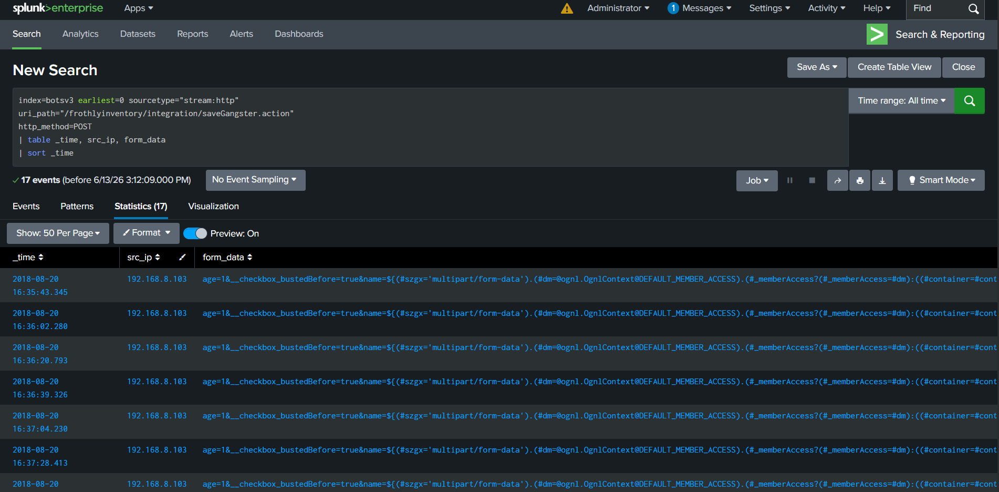
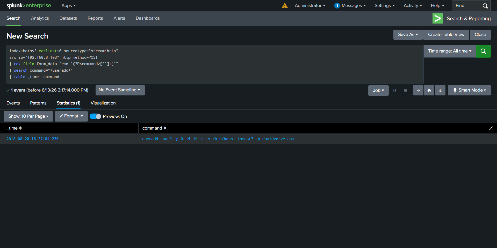

# 🔍 SOC Threat Detection Lab — Splunk SIEM


---

> 🏆 This project was built as part of my SOC Analyst
> portfolio to demonstrate real hands-on Splunk skills
> for fresher cybersecurity roles.

## 📌 Project Overview

A complete **SOC (Security Operations Center) home lab** built using **Splunk Enterprise** and the **BOTS v3 (Boss of the SOC)** dataset. This project simulates a real-world security investigation where I acted as an L1/L2 SOC analyst to detect, investigate, and respond to a full **APT (Advanced Persistent Threat)** attack chain.

The attack discovered was an **Apache Struts2 Remote Code Execution (CVE-2018-11776)** — the same vulnerability used in the infamous **Equifax data breach**.

---

## 🎯 Objectives

- Ingest and analyze real enterprise attack logs using Splunk
- Identify attacker IP through traffic pattern analysis
- Detect and investigate multiple attack techniques
- Map findings to the **MITRE ATT&CK Framework**
- Build a professional **SOC Dashboard**
- Write a complete **Incident Response Report**
- Write **SPL detection rules** for each attack

---

## 🛠️ Tools & Technologies

| Tool                                 | Purpose                           |
| ------------------------------------ | --------------------------------- |
| **Splunk Enterprise**                | SIEM — Log ingestion and analysis |
| **BOTS v3 Dataset**                  | Real enterprise attack log data   |
| **SPL (Search Processing Language)** | Writing detection queries         |
| **MITRE ATT&CK Framework**           | Mapping attack techniques         |
| **Splunk Dashboard Studio**          | Building SOC dashboard            |

---

## 📦 Dataset

**BOTS v3 (Boss of the SOC) Dataset**

- 🔗 **Dataset:** [Splunk BOTS v3 GitHub](https://github.com/splunk/botsv3)
- 📊 **Total Events:** 1,754,353
- 📅 **Incident Date:** August 20, 2018
- 🏢 **Fictional Company:** Frothly Inc.

> This dataset contains real attack logs from a 
> simulated enterprise environment used in 
> Splunk's Boss of the SOC competition worldwide.

---

## 📂 Repository Structure

```
SOC-Splunk-Project/
│
├── README.md                          ← You are here
│
├── screenshots/                       ← Evidence screenshots
│   ├── 01_sourcetypes.png            ← Available log sources
│   ├── 02_suspicious_post_urls.png   ← Attacker discovery
│   ├── 03_attacker_confirmed.png     ← Attack confirmation
│   ├── 04_attack_commands.png        ← Commands executed
│   ├── 05_backdoor_account.png       ← Persistence detected
│   ├── 06_kernel_exploit.png         ← Privilege escalation
│   ├── 07_c2_reverse_shell.png       ← C2 communication
│   ├── 08_suitecrm_credentials.png   ← Credential attack
│   └── 09_full_dashboard.png         ← Complete SOC dashboard
│
├── detections/                        ← SPL detection rules
│   ├── 01_suspicious_post_urls.spl
│   ├── 02_attacker_confirmed.spl
│   ├── 03_attack_commands.spl
│   ├── 04_c2_reverse_shell.spl
│   └── 05_backdoor_account.spl
│
└── reports/
    └── Incident_Report_Frothly_APT.pdf  ← Full incident report
```

---

## 🔍 Investigation Methodology

### Step 1 — Log Inventory

First I identified all available log sources:

```spl
index=botsv3 earliest=0
| stats count by sourcetype
| sort -count
```

📸 **Screenshot:**


---

### Step 2 — Attacker Discovery

Filtered suspicious POST requests to find attackers:

```spl
index=botsv3 earliest=0 sourcetype="stream:http"
http_method=POST
| stats count by uri_path, src_ip
| sort -count
| head 20
```

📸 **Screenshot:**


**Key Finding:** `/frothlyinventory/integration/saveGangster.action` receiving POST requests from `192.168.8.103`

---

### Step 3 — Attack Confirmation

Confirmed attacker by examining POST data:

```spl
index=botsv3 earliest=0 sourcetype="stream:http"
uri_path="/frothlyinventory/integration/saveGangster.action"
http_method=POST
| table _time, src_ip, form_data
| sort _time
```

📸 **Screenshot:**



---

### Step 4 — Command Extraction

Extracted all commands executed by attacker:

```spl
index=botsv3 earliest=0 sourcetype="stream:http"
src_ip="192.168.8.103" http_method=POST
| rex field=form_data "cmd='(?P<command>[^']+)'"
| where isnotnull(command)
| table _time, command
| sort _time
```

📸 **Screenshot:**


---

### Step 5 — Persistence Detection

Detected backdoor account creation:

```spl
index=botsv3 earliest=0 sourcetype="stream:http"
src_ip="192.168.8.103" http_method=POST
| rex field=form_data "cmd='(?P<command>[^']+)'"
| search command="*useradd*"
| table _time, command
```

📸 **Screenshot:**



---

### Step 6 — Kernel Exploit Detection

Detected privilege escalation attempt:

```spl
index=botsv3 earliest=0 sourcetype="stream:http"
src_ip="192.168.8.103" http_method=POST
| rex field=form_data "cmd='(?P<command>[^']+)'"
| search command="*colonel*"
| table _time, command
```

📸 **Screenshot:**


---

### Step 7 — C2 Communication Detection

Detected reverse shell to external C2 server:

```spl
index=botsv3 earliest=0 sourcetype="stream:http"
src_ip="192.168.8.103" http_method=POST
| rex field=form_data "cmd='(?P<command>[^']+)'"
| search command="*nc*" OR command="*backpipe*"
| where NOT like(command,"echo%")
| table _time, command
| sort _time
```

📸 **Screenshot:**


---

## 🚨 Attack Chain Discovered

```
15:15  →  Automated scanning of SuiteCRM (every 1 minute)
16:35  →  Apache Struts2 RCE exploit begins
16:36  →  Reconnaissance (whoami, id, groups)
16:36  →  Credential theft (cat /etc/passwd)
16:37  →  Backdoor account created (useradd tomcat7)
16:37  →  OS fingerprinting (uname -a, lsb_release)
16:38  →  Kernel exploit uploaded (colonel.c via base64)
16:40  →  Exploit decoded (base64 --decode)
16:42  →  Reverse shell pipe created (mknod /tmp/backpipe)
16:43  →  C2 connection established (nc 45.77.53.176:8088)
17:04  →  Second C2 connection attempt
```

---

## 🎯 MITRE ATT&CK Mapping

| S.NO | Tactic               | Technique                             | ID    |
| ---- | -------------------- | ------------------------------------- | ----- |
| 1    | Initial Access       | Exploit Public Application            | T1190 |
| 2    | Execution            | Command & Scripting Interpreter       | T1059 |
| 3    | Discovery            | System Information Discovery          | T1082 |
| 4    | Credential Access    | OS Credential Dumping                 | T1003 |
| 5    | Persistence          | Create Account                        | T1136 |
| 6    | Privilege Escalation | Exploitation for Privilege Escalation | T1068 |
| 7    | Defense Evasion      | Obfuscated Files or Information       | T1027 |
| 8    | Command & Control    | Application Layer Protocol            | T1071 |
| 9    | Lateral Movement     | Ingress Tool Transfer                 | T1105 |

---

## 📊 SOC Dashboard

Built a real-time SOC dashboard in Splunk Dashboard Studio with 5 panels:

| Panel            | Visualization | Purpose                           |
| ---------------- | ------------- | --------------------------------- |
| Attack Timeline  | Line Chart    | Shows attack activity over time   |
| Top Attacker IPs | Bar Chart     | Identifies most active IPs        |
| Attack Commands  | Bar Chart     | All commands executed by attacker |
| C2 Reverse Shell | Table         | Reverse shell connection evidence |
| HTTP Methods     | Pie Chart     | GET vs POST traffic distribution  |

📸 **Screenshot:**


---

## 📄 Key Findings

| Finding              | Detail                                 |
| -------------------- | -------------------------------------- |
| **Vulnerability**    | Apache Struts2 RCE — CVE-2018-11776    |
| **Attacker IP**      | 192.168.8.103 (Internal)               |
| **C2 Server**        | 45.77.53.176:8088                      |
| **Backdoor Account** | tomcat7                                |
| **Kernel Exploit**   | colonel.c (Linux privilege escalation) |
| **Attack Duration**  | 16:35 — 17:04 (29 minutes)             |
| **Total Commands**   | 14 unique commands executed            |
| **C2 Attempts**      | 2 reverse shell connections            |

---

## 🛡️ Recommendations

| Priority     | Action                                |
| ------------ | ------------------------------------- |
| 🔴 IMMEDIATE | Block 45.77.53.176 at firewall        |
| 🔴 IMMEDIATE | Disable backdoor account tomcat7      |
| 🔴 IMMEDIATE | Patch Apache Struts2 — CVE-2018-11776 |
| 🟠 HIGH      | Implement WAF for RCE protection      |
| 🟠 HIGH      | Monitor all outbound connections      |
| 🟡 MEDIUM    | Deploy IDS/IPS Snort rules            |

---

## 👨‍💻 About

**Suryagandhan S V**  
Fresher - Targeting SOC Analyst / L1 SOC roles

[](https://linkedin.com/in/suryagandhan)
[](https://github.com/suryagandhan)

---

> _"This project demonstrates real hands-on SOC analyst skills — log analysis, threat hunting, attack investigation, MITRE ATT&CK mapping, dashboard creation, and incident reporting using industry standard tools."_
